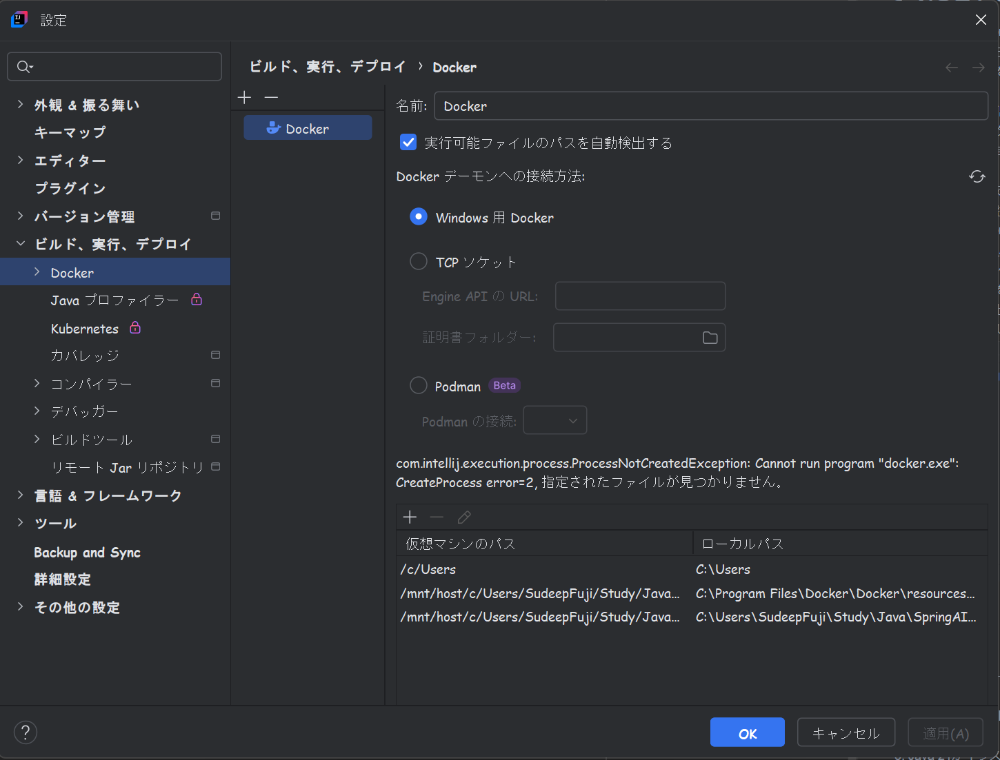

## 実行ビルド構成の設定するため、Intellij　Ideaで、以下の設定を行ってください。
1. Intellij IdeaでCloneされたフォルダを開く
2. Intellij　Ideaの左上のメニューにある「現在のファイル🔽」というボータンをクリックをして、 
構成の編集ボタンを表示されたら、 そこをクリックをしたら実行/デバッグ構成がポップアップ が出ます。
3. 左上の「＋」ボタンをクリックをして、「新規構成を追加」を表示されます。
そこからアプリケーションを選んでください。
4. 以下のように設定
名前:　SpringAiVectorApplication
ビルドと実行：
Java盤：21
メインクラス：com.example.springaivector.SpringAiVectorApplication
環境変数：OPENAI_API_KEY=あなたのOpenAIのAPIキーを入力してください
使用するモジュール：SpringAiVector
5. 適用をクリックをして、OKをクリックをしてください。
6. Intellij Ideaの右上の実行ボタンをクリックをして、アプリケーションを実行してください。
例：


## 注意点：
1. OpenAIのAPIキーを取得して、環境変数に設定する必要があります。
2. Mavenがインストールされていることを確認してください。
3. Java 21がインストールされていることを確認してください。
4. プロジェクトの依存関係が正しく解決されていることを確認してください。

本ポロジェクトを実行する方法：
Git clone をして、そこのフォルダパスにタミヤで入って、以下のコマンドを実行してください。

```
# テストをスキップしてビルド
mvn clean install -DskipTests
```

その後、Intellij Ideaで上記の設定を行い、アプリケーションを実行してください。
以下のリンクから、Qdrantのダッシュボードにアクセスして、コレクションが作成されていることを確認できます。
http://localhost:6333/dashboard#/collections

## 課題・問題

### Docker エラー
時々DockerとDocker ComposeはSpringAiでランタイムで見つかれませんというエラーが表示されます。
そういう時はDocker エクステンションをIntellijのマルケットプレスでインストールをして、ALT＋８を押下、
そして、サービスを開きます。そこの左上のDockerの画像に緑色が表示されたらDockerはちゃんとに動いていることは確認できます。
そうじゃない場合は、以下のようにしてください。
1. Intellijの設定に開いて「ビルダー、実行、デプロイ」に開いて、
2. そこからDockerに開いて、仮想マシンのパスとローカルパスを設定してください。
3. 仮想マシンのパスはWslターミナルから入って、そこから自分のプロジェクトのパスを探してください。
私の場合、
仮想マシンのパス：docker-desktop:/mnt/host/c/Users/SudeepFuji/Study/Java/SpringAI/SpringAIVector
ローカルパス：C:\Users\SudeepFuji\Study\Java\SpringAI\SpringAIVector


### OpenAI
OpenAIのAPIキーは何では知りませんですが１月で使うことできなかったです。
→もう一同APIキーを作成して設定すればいいです。

