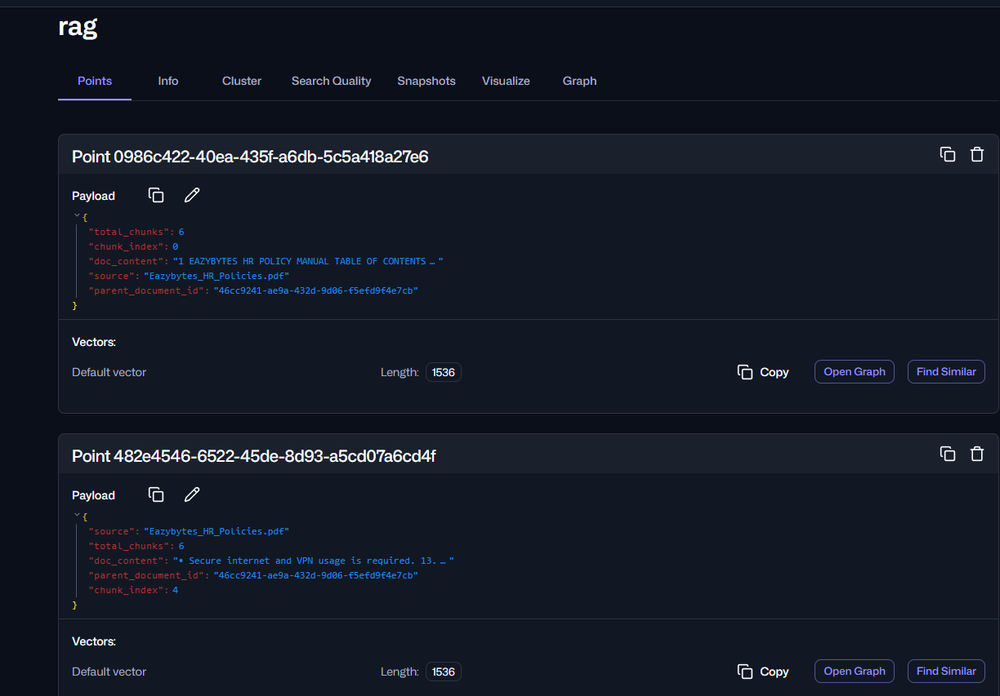

## ragプロジェクト

本プロジェクトでは、ヘルプデスクAIでチケット・切符を作成するプロジェクトです。
本プロジェクトで、行った主な処理は以下の通りです：
* サービス、ツール
* RAG操作： 書類ロードル、ウェブ検索 、日付を取得処理

### pdfファイルをベクタデータベースに読み込みする処理

1. 一般的なロード処理：
```java
    private final VectorStore vectorStore;
    Logger logger = Logger.getLogger(FullPdfLoader.class.getName());
    public FullPdfLoader(VectorStore vectorStore){
        this.vectorStore=vectorStore;
    }

    @Value("classpath:/Documents/CompanyInfo.pdf")
    Resource CompanyInfo;

//    @PostConstruct
    public void pdfLoader(){
        TikaDocumentReader tikaDocumentReader = new TikaDocumentReader(CompanyInfo);
        List<Document> companyInfo = tikaDocumentReader.get();
        vectorStore.add(companyInfo);
        logger.info("CompanyInfo got loaded to VectorStore");
    }
```
上記では、List<Document> companyInfo = tikaDocumentReader.get()をして、そのままでベクタデータベースにデータを保存しました（vectorStore.add(companyInfo)）。こういう感じで保存するのは、だめじゃないですがトークン使用化は高いです。
理由は全部データは一般的に読み込んで一つコレクションに保存ちゃってしまいます。そうなると毎リクエストでは、全部コレクションの内容を確認するようにしますので、トークン使用化が高いです。
2. チャンクに分かれて、ベクタデータベースに保存：
```java
   // pdfファイルパス
    @Value("classpath:documents/Eazybytes_HR_Policies.pdf")
    Resource hrPolicy;

    private final VectorStore vectorStore;

    public pdfLoaderRag(VectorStore vectorStore) {
        this.vectorStore = vectorStore;
    }

    @PostConstruct
    public void policyLoader() {
        TikaDocumentReader tikaDocumentReader = new TikaDocumentReader(hrPolicy);
        // Documentオブジェクト
        List<Document> docs = tikaDocumentReader.get();
        // withChunkSize() →　チャンクサイズ　→　トークンサイズ。200トークン
        // withMaxNumChunks() → 最大チャンク数　→　最大トークンサイズ　→　400
        TextSplitter textSplitter = TokenTextSplitter.builder().withChunkSize(200).withMaxNumChunks(400).build();
        vectorStore.add(textSplitter.split(docs));
    }
```
上記にの①番の問題 → 高いトークン使用化の解決はその書類は分割して、いくのです。そのような処理はチャンキングと言います。以下の2番目では、ちゃんとにチャンクサイズを設定されています。TokenTextSplitterメソッドを使って、チャンクに分かれます。

上の画像を見るとEazybytes_HR_Policies.pdfファイルはPointsに分かれております。
例えば：
Eazybytes_HR_Policies.pdf　→　「Pointアドレス0→チャンク＿インデックス：０、Pointアドレス１→チャンク＿インデックス：１、Pointアドレス２→チャンク＿インデックス：２、Pointアドレス３→チャンク＿インデックス：３、Pointアドレス４→チャンク＿インデックス：４、Pointアドレス５→チャンク＿インデックス：５」
全部＿チャンク　⇒　6.

### ウェブ検索RAG

```java

public class WebSearchDocumentRetriever implements DocumentRetriever {

    Logger logger = Logger.getLogger(WebSearchDocumentRetriever.class.getName());

    private static final String TAVILY_API_KEY = "TAVILY_API_KEY";
    private static final String TAVILY_BASE_URL = "https://api.tavily.com/search";
    private static final int DEFAULT_RESULT_LIMIT = 5;
    private final int resultLimit;
    private final RestClient restClient;

    public WebSearchDocumentRetriever(RestClient.Builder restClientBuilder, int resultLimit) {
        Assert.notNull(restClientBuilder, "Client builder cannot be null");
        String API_KEY = System.getenv(TAVILY_API_KEY);
        Assert.hasText(API_KEY, "Environment variable " + TAVILY_API_KEY + " must be set.");
        this.restClient = restClientBuilder
                .baseUrl(TAVILY_BASE_URL)
                .defaultHeader(HttpHeaders.AUTHORIZATION, "Bearer " + API_KEY)
                .build();
        if (resultLimit <= 0) {
            throw new IllegalArgumentException("resultLimit must be greater than o");
        }
        this.resultLimit = resultLimit;
    }

    @Override
    public List<Document> retrieve(Query query) {
        logger.info("Processing Query: {}" + query.text());
        Assert.notNull(query, "Query cannot be null.");

        String q = query.text();
        Assert.hasText(q, "Query.text() cannot be null.");
        //.body(TavilyResponsePayload.class) --> here this method will typeCast the responsePayload
        TavilyResponsePayload responsePayload = restClient.post()
                .body(new TavilyRequestPayload(q, "advanced", resultLimit))
                .retrieve()
                .body(TavilyResponsePayload.class);

        if (responsePayload == null || CollectionUtils.isEmpty(responsePayload.results())) {
            return List.of();
        }
        List<Document> documents = new ArrayList<>(responsePayload.results.size());

        for (TavilyResponsePayload.Hit hit : responsePayload.results()) {
            // Map each Tavily hit into a Spring AI Document with metadata and score.
            Document doc = Document.builder()
                    .text(hit.content())
                    .score(hit.score())
                    .metadata("title", hit.title)
                    .metadata("url", hit.url)
                    .build();
            documents.add(doc);
        }
        return documents;
    }

    @JsonNaming(PropertyNamingStrategies.SnakeCaseStrategy.class)
    record TavilyRequestPayload(String query, String searchDepth, int maxResult) {
    }

    record TavilyResponsePayload(List<Hit> results) {
        record Hit(String title, String url, String content, Double score) {
        }
    }

    public static Builder builder() {
        return new Builder();
    }

    public static class Builder {

        private RestClient.Builder restClientBuilder;
        private int resultLimit = DEFAULT_RESULT_LIMIT;

        private Builder() {
        }


        public Builder restClientBuilder(RestClient.Builder restClientBuilder) {
            this.restClientBuilder = restClientBuilder;
            return this;
        }

        public Builder maxResults(int maxResults) {
            if (maxResults <= 0) {
                throw new IllegalArgumentException("maxResults is not set. ");
            }
            this.resultLimit = maxResults;
            return this;
        }

        public WebSearchDocumentRetriever build() {
            return new WebSearchDocumentRetriever(restClientBuilder, resultLimit);
        }
    }

}
```
※上記クラスいきなり実装するのは不可雑ですが本当はVectorStoreDocumentRetrieverのクラスを下げして、そのような実装行っていいです。（VectorStoreDocumentRetriever implements DocumentRetriever）